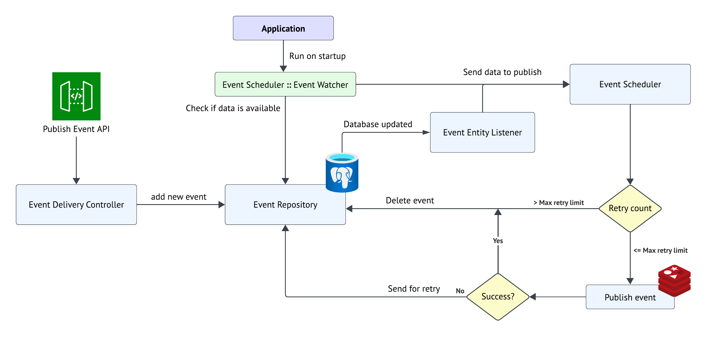

# Redis Event Delivery

<p>
<a href="https://github.com/AbhishekChd/redis-event-delivery/blob/main/LICENSE">
  
</a>
<a href="https://github.com/AbhishekChd/redis-event-delivery/pkgs/container/redis-event-delivery">
  
</a>

</p>

Event Delivery system to fan-out multiple requests or events to multiple destinations built on top of **Redis**. The system is based on scalable publisher-subscriber pattern and containerised using **Docker**.

## Table of contents
- [Features](#features)
- [Installation](#installation)
    - [Docker deployment](#docker-deployment)
    - [Requirements for local development](#requirements-for-local-development)
- [Design](#design)
    - [Publish Event API](#publish-event-api)
    - [Successful Event](#successful-event)
    - [Failed Event](#failed-event)


## Features

### 1. Durability
Once API receives the event, it persists the data before performing any other actions making the event data secure and durable.

### 2. At-least-once delivery
Whenever failure occurs, the system will push to publish event data again until it gets at least one successful publish.

### 3. Retry backoff and limit
We have flexible `MAX_RETRY` limit to stop error prone events from blocking the queue.

We further have an **Exponential backoff** algorithm implemented for retry so it does not overload the Consumer.

$w = Base\ wait\ duration$ <br>
$n = Number\ of\ times\ publish\ event\ was\ tried$ <br>
$r = Small\ random\ delay\ for\ variance$

$backoff\_delay =  w \times 2^n \pm r$


### 4. Maintaining order
The events always maintain a **FIFO** order based on `event_recieved_time` and will always follow the same order even in case of failures.

### 5. Delivery Isolation
Current implementation does not support isolation, but is open to extension. Isolation can be achieved by separating channels to publish for each **Comsumer**, and scaling the database tables based on **Consumer**. This will make queues isolated and much faster in execution.

---

## Installation

### Docker deployment

```shell
# We can modify image in docker-compose.yml to get live image from GitHub
# Or build local Doccker image like given below
docker build . --tag abhishekchd/redis-event-delivery

# Deploy the container to Docker
docker compose -f ./docker-compose.yml -p redis-event-delivery up -d
 
# Call API to verify if the app is up and running
curl --location --request POST 'http://localhost:8080/publish-event' \
--header 'Content-Type: application/json' \
--data '{
    "userId": "user-id-1",
    "payload": "Event payload"
}'

# Response from live server
$ Received event: Event(userId=user-id-1, payload=Event payload)
```

### Requirements for local development
1. PostgresSQL 15
2. Redis server


## Design


<h4 align="center">Redis Event Delivery System Design</h4>

### Publish Event API

Send event payload through the **Publish Event API** using `POST` to securely transfer data.

```
POST /publish-event HTTP/1.1
Host: localhost:8080
Content-Type: application/json
{
    "userId": "<user-id>",
    "payload": "<Event Payload>"
}
``` 

### Successful Event

After the event is successfully published, data is deleted from database permanently.

```
[INFO] i.g.a.r.scheduler.EventScheduler         : Event Watcher Running
[INFO] i.g.a.r.scheduler.EventScheduler         : Loaded event 7f000001-8a3c-1f0e-818a-3cef5b3f0000 from database
[INFO] i.g.a.r.scheduler.EventScheduler         : Scheduled event 7f000001-8a3c-1f0e-818a-3cef5b3f0000 with delay of 502
[INFO] i.g.a.r.publisher.RedisEventPublisher    : Channel: sample-queue, Message: Event(userId=user-id-1, payload=Message from Postman)
[INFO] i.g.a.r.subscriber.EventSubscriber       : Received <Event(userId=user-id-1, payload=Message from Postman)>
[INFO] i.g.a.r.subscriber.EventSubscriber       : Processed Message <{"userId":"user-id-1","payload":"Message from Postman"}>
[INFO] i.g.a.r.scheduler.EventScheduler         : Event 7f000001-8a3c-1f0e-818a-3cef5b3f0000 successfully published in 0 retries
```

### Failed Event

We have **Scheduled Events** with delay using backoff algorithm, and are always retried in **FIFO** order.

#### Event Faliure Logs
```
[INFO] i.g.a.r.scheduler.EventScheduler         : Event Watcher Running
[INFO] i.g.a.r.scheduler.EventScheduler         : Loaded event 7f000001-8a3c-1e16-818a-3cde32ad0000 from database
[INFO] i.g.a.r.scheduler.EventScheduler         : Scheduled event 7f000001-8a3c-1e16-818a-3cde32ad0000 with delay of 508
[INFO] i.g.a.r.publisher.RedisEventPublisher    : Channel: sample-queue, Message: Event(userId=user-id-1, payload=Message from Postman)
[INFO] i.g.a.r.subscriber.EventSubscriber       : Received <Event(userId=user-id-1, payload=Message from Postman)>
[INFO] i.g.a.r.subscriber.EventSubscriber       : Processed Message <{"userId":"user-id-1","payload":"Message from Postman"}>
[INFO] i.g.a.r.scheduler.EventScheduler         : Event 7f000001-8a3c-1e16-818a-3cde32ad0000 failed - Failed to deliver. Pushing for retry.
```

#### Event retry using backoff algorithm and retry limit of 4
```
[INFO] i.g.a.r.scheduler.EventScheduler         : Scheduled event 7f000001-8a3c-1e16-818a-3cde32ad0000 with delay of 1008
[INFO] i.g.a.r.scheduler.EventScheduler         : Scheduled event 7f000001-8a3c-1e16-818a-3cde32ad0000 with delay of 2004
[INFO] i.g.a.r.scheduler.EventScheduler         : Scheduled event 7f000001-8a3c-1e16-818a-3cde32ad0000 with delay of 3994
[INFO] i.g.a.r.scheduler.EventScheduler         : Scheduled event 7f000001-8a3c-1e16-818a-3cde32ad0000 with delay of 7997
[INFO] i.g.a.r.scheduler.EventScheduler         : Event 7f000001-8a3c-1e16-818a-3cde32ad0000 failed - Failed to deliver. Retry limit of 4 reached.
```
